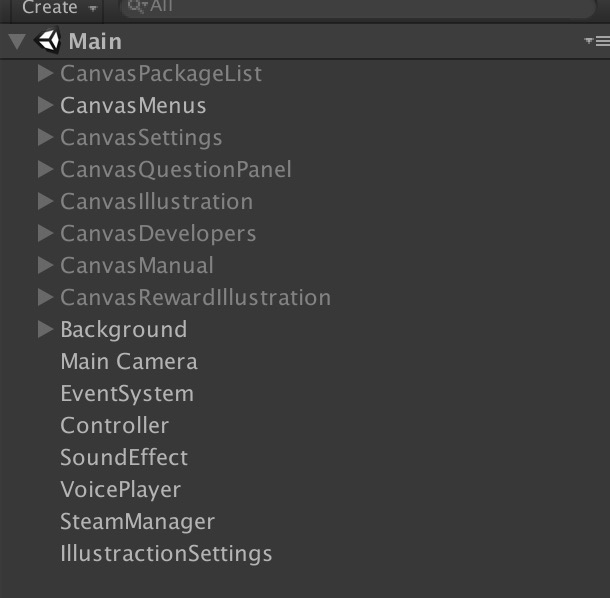

# Puzzle Sisters:Foer 谜题姐妹：菲迩

http://store.steampowered.com/app/710190/Puzzle_SistersFoer/

## TODOs

https://tower.im/projects/f792d0b8dd284d8e853f457e6668e386/

## 目录

```
PuzzleSister  // Unity项目
Steam         // Steam上线环境
SteamCmd      // SteamCmd安装目录
tools         // 题目生成工具
xlsx          // 题目
```

## Unity项目

主要介绍**Assets/PuzzleSister**下的目录

```
Asset         // 资源目录：场景，UI，Prefab
BugFixes      // 兼容Unity自己的bug
Common        // 共用程序
Controller    // 业务逻辑
Data          // 题库数据模块：读取，解析
Editor        // UnityEditor扩展
QEditor       // 题库编辑器代码
Resources     // 动态加载的资源：题库，音频等
Service       // 数据封装层
Settings      // 游戏设置相关
Storage       // 存储相关
View          // 视图层
Voice         // 语音相关
```

## Main场景



* **CanvasXXX** 是不同的UI模块的Canvas层
* **Controller** 对象放置所有的Controller
* **SoundEffect** 播放音效时使用此对象
* **VoicePlayer** 播放配音时使用此对象
* **IllustrationSettings** 图鉴配置

## UI构建说明

TODO ...

## QEditor、题库、DLC与创意工坊

**QEditor**是提供给玩家或者内部人员编辑题目以达到制作DLC和创意工坊包的目的

题库定义：

* [Package](https://github.com/zzmingo/PuzzleSister/blob/develop/PuzzleSister/Assets/PuzzleSister/Data/Package.cs) : 题库
* [Question](https://github.com/zzmingo/PuzzleSister/blob/develop/PuzzleSister/Assets/PuzzleSister/Data/Question.cs) ：题目

## 发布

> 注：此步是发布到开发环境，所以无需担心

首先你需要运行 **install_steamcmd.sh**，会安装**SteamCmd**到项目的 **SteamCmd**目录下。

运行 **PuzzleSister** Unity项目后，可以通过自定的扩展菜单进行Build项目

```
Puzzle Sisters -> Build All Platforms For Steam
```

Build完毕后可以使用**Steam/run_app_build.sh**来上传项目

上传完毕后将使用**SteamWorks**进行发布一下
